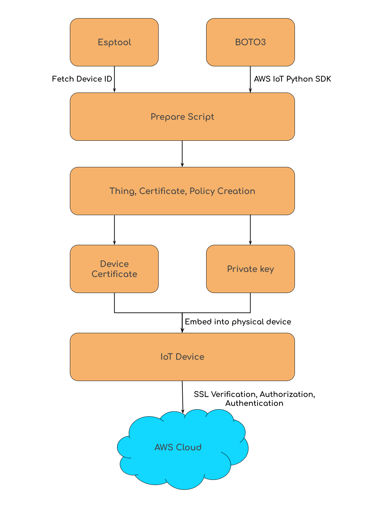
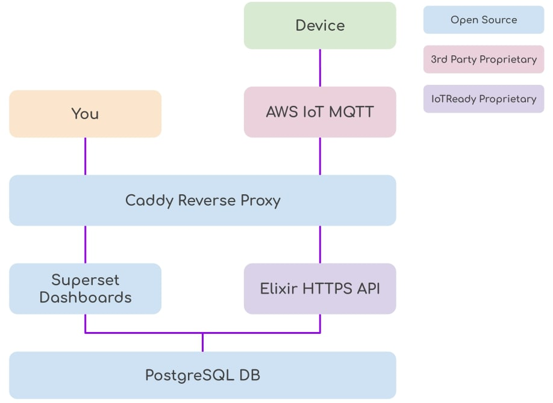

# Preparing a product for the IoT World

We have learned through multiple iterative development cycles, that one of the most important qualities for a product is scalability and as for a designer, envisioning the product a couple of months or years down the road depending on their predicted growth is of paramount importance. If you are confident in your product, you will surely have to think about building it towards the impact you want it to create, and do so right from the start. Failure to do this could impact sales, quality and in many cases, failure of a product that was otherwise splendid!

One of the things that needs due consideration is flashing the devices with firmware during manufacturing. Now that you did everything right, and you're shipping thousands of units every day, to make this manufacturing process significantly more efficient, saving time and effort becomes a key ingredient to higher sales and hence contributing to even higher success of the product. That is why this particular time, I will talk about automating flashing/burning firmware into your products while saving time and effort with an example on the colossal ESP32.

Espressif has given us the [esptool](https://github.com/espressif/esptool) utility to take care of multiple such needs required in order to scale our manufacturing. It is a python-based, open-source utility that can be used to communicate with the ESP32 bootloader. For details, visit esptool [repo](https://github.com/espressif/esptool). 

## Need for a unique identifier while flashing firmware
We know that when deploying a fleet of multiple devices, nomenclature of these devices are of the essence for various obvious reasons:
- Identification
- Grouping
- Analysis, etc.

More often than not, we might find ourselves in a need to use these identifiers before the devices are deployed to the "field". For ESP32s, we use the unique 12-digit default MAC address as `device_id`/`thing_name` of the device for:
- Registering them on the cloud
- Adding/embedding certificates and keys for security

What are IoT devices incomplete without? Yep, data collection. Where do you send this data? To your data observers on the internet. How does our data observers know what data comes from which device? You guessed it! The devices need to be pre-registered. One more vitally important reason to pre-register these devices is security and verification. How do you stop an unknown device from sniffing your data? By restricting the connectivity to a group of pre-registered devices. Okay, lets slow down and see what I'm talking about in a little more details.

Let's look at an example scenario using AWS IoT Core since [AWS accounted for a third of $42 billion cloud market in Q1 2021](https://telecoms.com/509588/aws-accounted-for-a-third-of-42-billion-cloud-market-in-q1-2021/). Here's a quick get-started with AWS IoT Core for you:

1. Register each device as a unique "thing" on AWS IoT Core server
2. Create and attach a certificate to the thing you just created
3. Download the device certificate, private key and public key. Use them in your device to enable SSL verification for your device to the AWS IoT server.
4. Connect to AWS IoT from your device and start pushing data into the cloud!

> For more details on this, please visit https://docs.aws.amazon.com/iot/latest/developerguide/iot-gs.html

This can be done in two ways:
1. [AWS IoT Core console](https://docs.aws.amazon.com/iot/latest/developerguide/iot-moisture-create-thing.html)
2. [AWS CLI Tool](https://docs.aws.amazon.com/cli/latest/reference/iot/)
3. One of [several SDKs available](https://docs.aws.amazon.com/iot/latest/developerguide/iot-sdks.html).

We want to bring to you two ways of getting data into the AWS cloud:

## The Prepare Script
The prepare script is a tool that automates the creating and flashing devices making them ready-to-deploy by just one command, saving time in abundance. It does the following:
1. Use esptool to get the default MAC address of the device.
2. Create a policy if it does not already exist. To learn about policies in AWS, visit [here](https://docs.aws.amazon.com/iot/latest/developerguide/iot-policies.html).
3. Create keys(private and public) and certificate for the device and save them as files.
4. Attach the existing/created policy in step2 to the certificate.
5. Create a new thing with the MAC address achieved in step1 as thing name.
6. Copy/embed the downloaded certificate and keys files into the necessary folder.

<p style="text-align:center;"></p>

### How to use prepare.sh:
- You will need AWS configured in your device in order to automatically access your AWS and do the various steps above. If you haven't already:
    - Install the python AWS CLI on your machine
    ````
    $ pip3 install awscli
    ````
    - Once done, run the command below to configure your AWS security credentials by providing the respective values:
    ````
    $ aws configure

    AWS Access Key ID [None]:
    AWS Secret Access Key [None]:
    Default region name [None]:
    Default output format [None]:
    ````
    > For more details on AWS access keys :https://docs.aws.amazon.com/general/latest/gr/aws-sec-cred-types.html#access-keys-and-secret-access-keys<br>
    For more details on AWS CLI: https://docs.aws.amazon.com/cli/latest/userguide/cli-chap-welcome.html

- You will need esptool and boto3 installed. Just run:
````
$ pip3 install -r requirements.txt
````
- Make sure you have configured the AWS variables in [registerDevice.py](./registerDevice.py#L19)
- Put your code project into a directory named `source`. This can be changed in the script.
- Connect your ESP32 
> This script is designed to be used for production firmware. Therefore, at every run, it stashes and pulls from the remote git repo. Please move ahead accordingly.
- The AWS certificates will be stored in a folder named `aws_credentials` directory according to the current setup. You can change this in the registerDevice.py file. Make sure the directory exists before you run the script.
- Run prepare.sh in your project folder.

**Note:**
- If the project is not a git repository, comment lines 9 and 10 in prepare.sh
- Make sure the prepare.sh file has executable permission:
````
$ sudo chmod +x prepare.sh
````

Now that we have looked at the command line tool at a lower level, it is completely fair for most people to say that they would rather want to focus on other things and wish they had an even higher level of automated tool which takes care of all of the above. It is time that we present to you a product that makes all of the above even simpler * 3000. 

## Introducing [Bodh](https://bodh.iotready.co/)
Meet your IoT Concierge! Most companies get too little from their IoT deployments, after spending too long & too much. Don't become one of them.

Bodh takes you from signing up to insights in **LITERALLY** two minutes. Without compromising on security, robustness or scale. No more hassles, only bedazzles! Take a look at the get-started video on https://bodh.iotready.co to spend two precious minutes of your time on how to get started with a cloud connected device and then take another two minutes to actually get your device sending data into the dashboard!

<p style="text-align:center;"></p>

> Bodh at https://bodh.iotready.co<br>
 Get the CLI tool at https://github.com/IoTReady/bodh_cli<br>
 Documentation at https://bodh.iotready.co/docs


